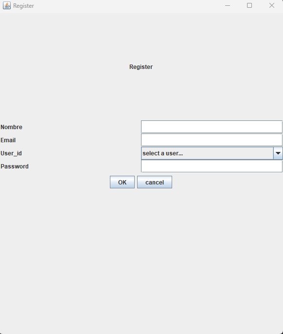

# Gestor Password
>- simple GUI App for password management.
>- created using MYSQL, JAVA SWING and AWT.


# Dependencies
>- [java-mysql-orm](https://github.com/AlfonsoG-dev/java-mysql-eje)
>- [java-build-tool](https://github.com/AlfonsoG-dev/javaBuild)
>- [mysql JDBC](https://dev.mysql.com/downloads/connector/j/5.1.html)
>- [mysql-transactions](https://dev.mysql.com/doc/refman/8.0/en/savepoint.html)
>- [java-jdk-17](https://www.oracle.com/java/technologies/javase/jdk17-archive-downloads.html)
>- [java_swing](https://www.tutorialspoint.com/swingexamples/index.htm)

# Features

- [x] login 
- [x] list, add, delete and update passwords
- [x] allow insert cuenta directly from table
- [x] allow to commit changes o rollback if wanted

# Usage

- use the user and password
- to use drag and drop to the table.
>- the drag text format must bee: 
```console
id,nombre,email,user_id_fk,password,null,null
```


------

- panel that contains the table and functionality
- the table have to the right side 3 button that represents: 
>- reload, insert row, delete row


------

- if no new row has been inserted or the inserted row have no data, insert button redirect to another frame
- if you insert a row you must press enter when finish the register of the data



- a column must be selected before click update button


------

# Aditional options to use

>- Create the database and tables.
>>- using the [java-mysql-orm](https://github.com/AlfonsoG-dev/java-mysql-eje)
>>- first you need to digit the DbConfig parameters
```java
private final static DbConfig InitDB(String db_name) {
    String emptyValue = "this always need to be empty"
    DbConfig mConfig = new DbConfig(emptyValue, "host", "port", "db_user", "db_user_password");
}
```
>>- second you need to change the name of the database to create
```java
private final static void LogginUser() {
    try {
        DbConfig miConfig = InitDB("name of the database");
    } catch(Exception e) {
        System.err.println(e);
    }
}
```
>>- at launch you register the user for the accounts

# Compile and execute
>- using [java-build-tool](https://github.com/AlfonsoG-dev/javaBuild)
>>- if the javaBuild.exe is in path

>>- to compile
```console
javaBuild --build
```

>>- to execute
```console
java -jar app.jar
```

>- if using the powershell script
>>- Extraction of the jar file dependencies
1. download the *java-mysql-eje* project inside the lib folder of the project
2. inside java-musql-eje project create a jar file
3. create a folder with the name of *extractionFiles*
4. in the extractionFiles folder create a folder with the name *java_mysql_eje*
5. move the jar file to *extractionFiles/java_mysql_eje/* folder
6. extract the content of the jar file using the *java -xf command*

>>- Compile the project
1. using powershell create a *java-exe.ps1* file in the root of the project
2. create the script to compile and execute the program

``` powershell
$Clases = "./src/*.java ./src/Interface/Panels/*.java"
$Compilation = "javac -cp " + '"./bin/;path to the custom jar file" -d ./bin/ ' + "$Clases";
$javaCommand = "java -cp " + '"./bin;path to a custom jar file" .\src\App.java';
$runCommand = "$Compilation" + " & " + "$javaCommand"
Invoke-Expression $runCommand
```

# Disclaimer
>- this project is for educational purposes
>- security issues are not taken into account
